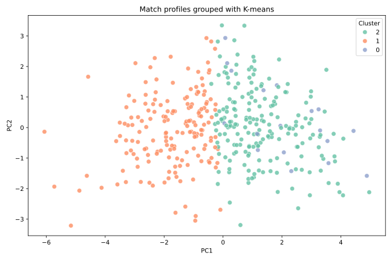
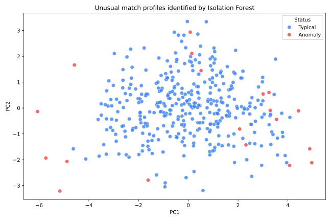

# Football Match Clustering and Anomaly Detection

An unsupervised-learning project exploring English league match patterns using
K-means clustering, PCA and Isolation Forest.

## What the analysis does

- standardises goals, shots and possession-derived match features;
- projects the feature space into two principal components;
- groups similar matches with K-means;
- evaluates cluster separation with a silhouette score; and
- highlights unusual matches with Isolation Forest.

## Visual results

| Match clusters | Detected anomalies |
|---|---|
|  |  |

## Run locally

```bash
python -m venv .venv
source .venv/bin/activate
pip install -r requirements.txt
python src/analyse_matches.py --data data/soccer_matches.csv --output artifacts
```

The original academic script has been refactored to use portable file paths,
validated column mappings and reproducible model settings.

## Dataset

The analysis expects the standard Football-Data match schema documented in
[`data/README.md`](data/README.md). Raw data is not redistributed here.

## Author

**Gokul Anand Srinivasan**  
[Portfolio](https://gokulanand2307.github.io/) | [GitHub](https://github.com/GokulAnand2307)
